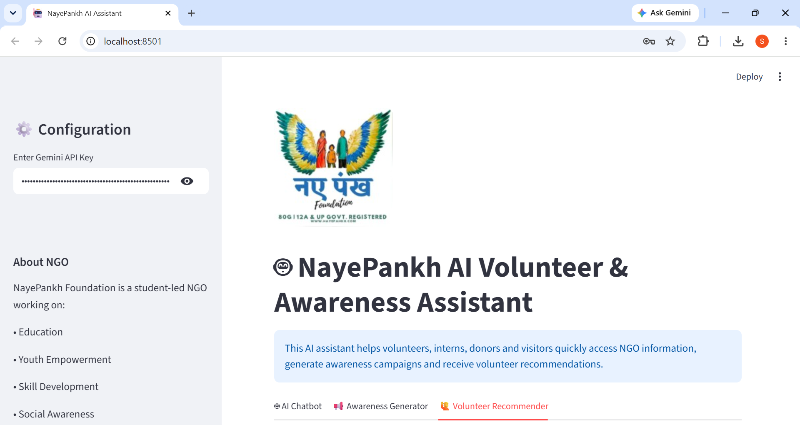
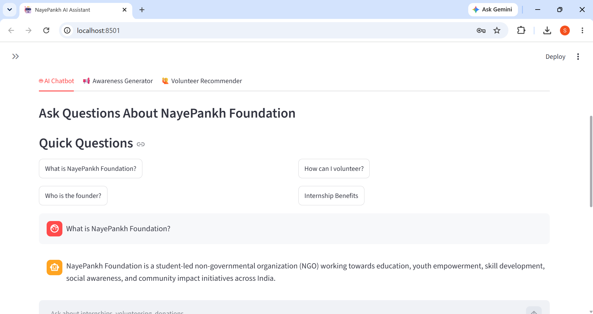
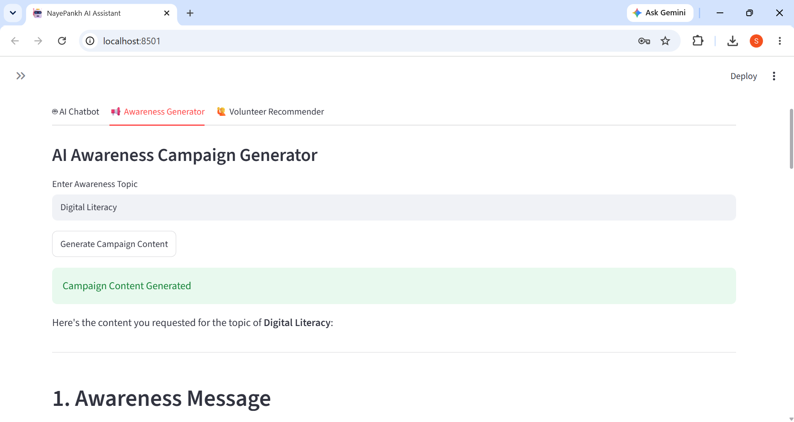
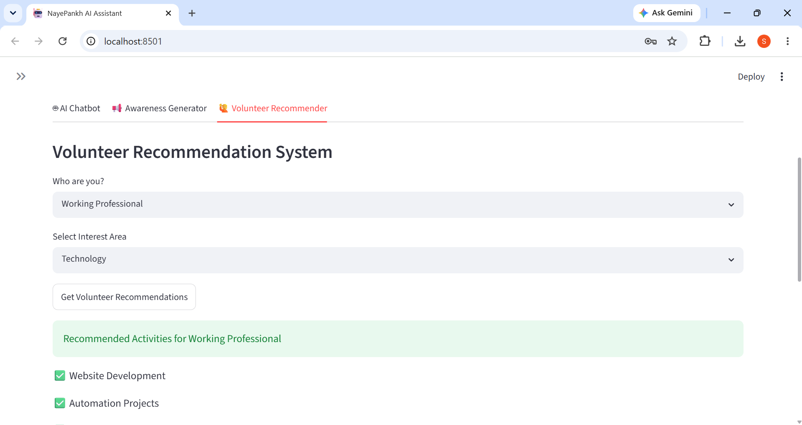

# 🤖 NayePankh AI Volunteer & Awareness Assistant

## Overview

NayePankh AI Volunteer & Awareness Assistant is an AI-powered web application developed using Python, Streamlit, and Google Gemini AI.

The application helps automate NGO support by answering volunteer and internship-related queries, generating awareness campaign content, and recommending suitable volunteer activities based on user interests.

This project demonstrates how Artificial Intelligence can improve information accessibility, volunteer engagement, and awareness initiatives within non-profit organizations.

---

## Features

### 🤖 AI NGO Chatbot

* Answers questions related to NayePankh Foundation
* Provides internship and volunteer information
* Uses a custom NGO knowledge base
* Powered by Google Gemini AI

### 📢 Awareness Campaign Generator

Generates:

* Awareness Messages
* Instagram Captions
* LinkedIn Posts
* Relevant Hashtags

### 🙋 Volunteer Recommendation System

Provides personalized volunteer activity recommendations based on:

* User Role
* Interest Area

### 📞 NGO Contact Information

Displays official contact details for NayePankh Foundation.

---

## Technology Stack

* Python
* Streamlit
* Google Gemini AI
* Generative AI
* Prompt Engineering

---

## Project Structure

```text
NayePankh-AI-Volunteer-Awareness-Assistant/
│
├── app.py
├── knowledge_base.txt
├── requirements.txt
├── README.md
├── logo.png
├── home.png
├── chatbot.png
├── awareness_generator.png
└── volunteer_recommender.png
```

---

## Screenshots

### Home Page


### AI Chatbot


### Awareness Generator


### Volunteer Recommendation System


---

## Installation

### Clone Repository

```bash
git clone https://github.com/SadiyaBanu196/NayePankh-AI-Volunteer-Awareness-Assistant.git
```

### Install Dependencies

```bash
pip install -r requirements.txt
```

### Run Application

```bash
streamlit run app.py
```

---

## Streamlit Secrets Configuration

Create Streamlit secrets and add:

```toml
GEMINI_API_KEY = "YOUR_GEMINI_API_KEY"
```

---

## Use Cases

* Volunteer Support Automation
* Internship Information Assistant
* NGO Awareness Campaign Creation
* Information Accessibility Improvement
* Community Engagement Support

---

## Future Enhancements

* Multi-language Support
* Voice Assistant Integration
* PDF-Based Knowledge Base
* Volunteer Registration System
* Event Management Integration
* AI-Powered Donation Assistant

---

## Live Demo

Streamlit App:

https://nayepankh-ai-volunteer-awareness-assistant-dduwlkka8bcjydrkadj.streamlit.app/

---

## Repository

GitHub Repository:

https://github.com/SadiyaBanu196/NayePankh-AI-Volunteer-Awareness-Assistant

---
## Developed For

Artificial Intelligence Internship Selection Task

NayePankh Foundation

---

## Author

Sadiya Banu Syed

Engineering Student | AI & Machine Learning Enthusiast
